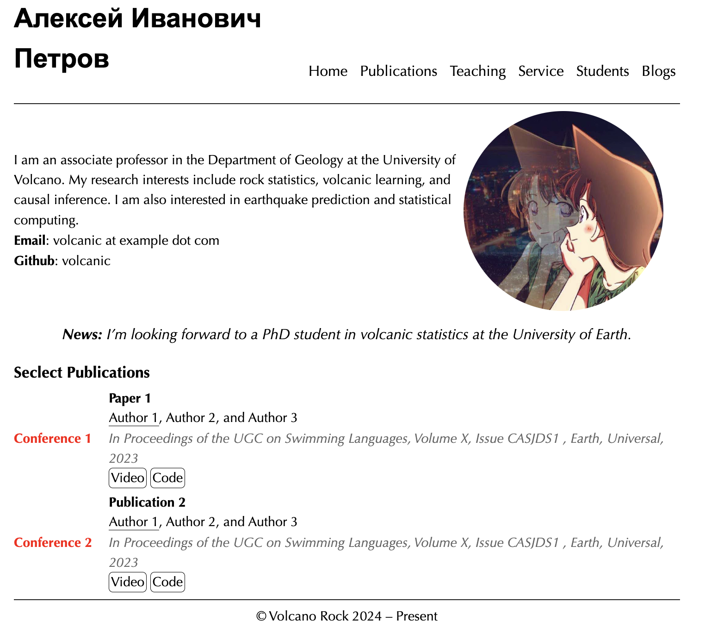

# HUGO MIN ACADEMIC

## Introduction

This theme is a simple academic CV theme designed for PhD students and professors. It allows you to easily display personal information, publications, services, courses, and research updates without needing to write any code. You can simply write in Markdown to achieve a clean appearance.

I created this theme because I prefer simple style compared to complex website built by a lot of JS code, I'm not a website builder.

## Tutorial

Copy the hugo.yaml to your website's root directory as config.yaml.

### Menu

If you don't want to display a menu (for example, you don't have any papers yet like me), simply comment the relevant line in config.yaml to hide this.

### Homepage

Place your icon in the `static/images/` directory.

If you want to hide specific information on the homepage, comment the corresponding lines in config.yaml.

### Publications

Add your publications details in `content/publications.html`.

### Teacing, Service, and Students

Just add content to the respective files in `content/` directory, in markdown.

### Blogs

Write your blogs in the `content/post/` directory.

## Screenshot

## Acknowledgement

This theme is derived from [hugo-xmin](https://github.com/yihui/hugo-xmin) made by [Yihui Xie](https://yihui.org).
